## What is Kubernetes ??

* __K8'S__ is an open source orchestration platform.
* __K8's__ is used to manage containers 
* __K8's__ developed in GOOGLE & denoted to CNCF
* __K8's__ provide a framework for managing the complex task of deploying , scaling and operating applications in Containers .

## What is Micro-Services Architecture ??

  * In Micro-Services Architecture , each and every functionality will be implemented as a part of different project called __API__.

  * Each project __(Back-End API)__ will have a separate container and code will be running in that container and for managing those containers , we need some orchestration platform .

  * __K8's__ is that Orchestration tool where we can manage the Containers .

     * 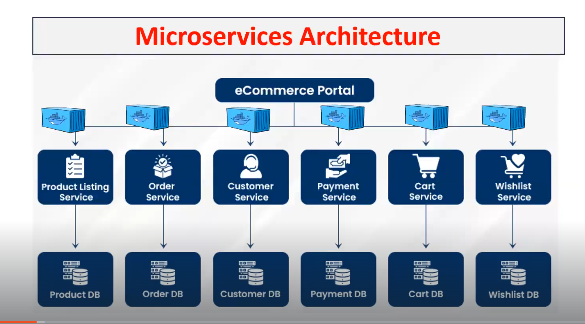

## Advantages of Kubernetes ?? 

* __Auto-Scaling:__ : Based on demand containers count will be increased or decreased.

* __Load Balancing:__  Load will be distributed all containers which are up and running

* __Self Healing :__ If any container got crashed then it will replaced with new container

## Kubernetes-Architecture & its Core Components !!

* K8's will follow the Cluster Architecture (Group of Servers)

   * Master Node (Control Plane)
   * Worker Nodes 

* K8's control panel will contain below components.

  * __API-SERVER__
  * __SCHEDULER__ 
  * __CONTROLLER -MANAGER__
  * __ETCD__

* K8's worker nodes will contain below components.

  * __POD__
  * __CONTAINERS__
  * __DOCKER-ENGINE__
  * __KUBLET__
  * __KUBE PROXY__


* To communicate with the K8's control plane , we have 2 options 

  * __UI (Web Dashboard)__
  * __kubectl (CLI)__

  
  * 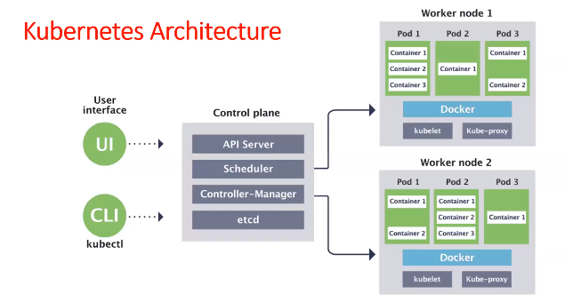

* __API-server__ will receive incoming requests and it will store into __ETCD .__

* __ETCD__ is K8's cluster database.

* __Scheduler__ will check pending tasks in ETCD and it will schedule those tasks in worker nodes.

* __Scheduler__ will get available worker nodes information by using __Kubelet.__

* __Kubelet__ is called as Worker node agent 

* __Kube-Proxy__ provides network for Cluster Communication .

* __POD__ is the smallest building block that we can deploy in K8's cluster. __POD__ represents the runtime instance of our application 

__NOTE:__ In K8's everything will be executed as a POD. Inside POD containers will be available.

* __Controller-Manager__ will monitor all K8's resources functionality .

## K8's Cluster -Setup :

* __Mini Kube__ => Single Node cluster => Only for practice

* __Kubeadm Cluster__ => Self Managed Cluster => We are responsible for everything

* __Provider Managed Cluster__ => Ready Made Cluster => Provider will take care of everything
  * __Ex :__ AWS EKS, Azure AKS, GCP GKE etc ..

__NOTE:__ Provider Managed Clusters are chargable.

* __Follow the below document to set-up the K8's Cluster.__

   * EKS Setup : https://github.com/ashokitschool/DevOps-Documents/blob/main/05-EKS-Setup.md

     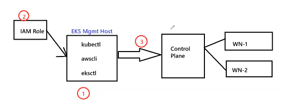

     

    * Here we are creating the cluster manually , but in real time it will be created by the __Terraform scripts.__

    * We are creating the __EKS Mgmt Host machine__ and in that machine we are providing the __IAM role__ so that this machine has the capability to create the cluster in the cloud and installing the below softwares

    * __kubectl :__ It is used to interact with the control plane (master node) in the K8's cluster .

    * __awscli :__ It is the AWS command line. 

    * __eksctl :__ It is used to create the cluster in AWS.

    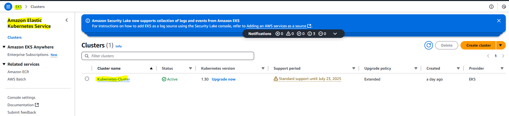

    * 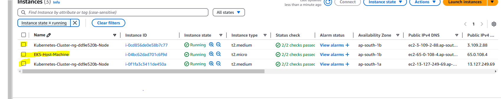

    * __What is .kube/config file ?__

       When the cluster is created , cluster information is copied to our host machine by using .kube/config file . This file contains the cluster information. In our host machine .kube/config file is available and because of the .kube/config file our host machine is able to communicate with the control plane through kubectl.

        *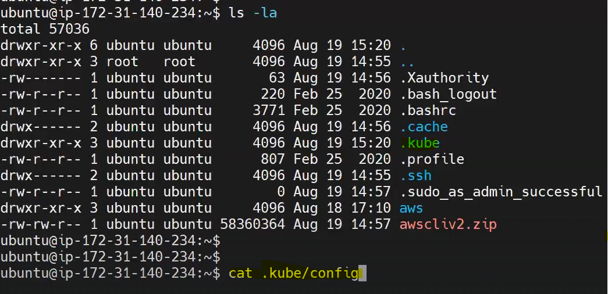


## Kuberbetes Resources :

* __1) PODS__

* __2) Services__ (Cluster IP, Node Port, Load Balancer)

* __3) Namespaces__

* __4) ReplicationController (RS)__

* __5) ReplicaSet__

* __6) DeemonSet__

* __7) Deployment__

* __8) StatefulSet__

* __9) IngressController__

* __10) HPA__

* __11) HelmCharts__

## What is POD ?

* POD is a smallest building block that we can deploy in K8's cluster 
* Our application will be deployed inn K8s cluster as a POD .
* For one application we can create multiple POD replicas for high availability.
* For every POD , one IP address will be generated.
* If POD got damaged/crash then K8's will replace it (SELF-HEALING)
* To create PODS , we will use __MANIFEST YML Files__

__NOTE :__ By Default , PODS are accessible only with-in the cluster , we cannot access the POD's outside the cluster .

__NOTE:__  To expose PODS for outside access , we need to use K8's services concept.

## What is service in K8's ??

* K8's service is used to expose PODS .

* We have 3 different types of services .

   * __Cluster IP__  (To access PODS with in the cluster)
   * __Node Port__  (To access PODS using NODE Public IP)
   * __Load Balancer__ (To distribute the traffic to POD replicas)

## What is Namespace in K8's ??

* Namespace is used to group our resources in Cluster .

   * __EX :__ fronend PODS in one namespace , backend PODS in one namespace , db PODS in one namespace.

  __NOTE :__ When we delete a namespace all its resources will be deleted .

## What is YAML ??

  * YAML is __Yet Another Markup Language__
  * YAML files are both human and machine readable .
  * YAML files will have .yml/.yaml extension.
  * In K8's we will use YML files for Configuration.

  * ### K8's Manifest YML Syntax:

* ```yaml
   ---
   apiVersion: <version-number>
   kind:  <resource-type>
   metadata: <name>
   spec: <container>
   ...
  ```

* ### K8s POD Manifest YML :

Create the __pod-manifest.yml__ file and add the below code to create the __POD.__

```yaml
---
apiVersion: v1
kind: Pod
metadata:
 name: javawebapppod
 labels:
  app: javawebapp
spec:
 containers:
 - name: javawebappcontainer
   image: ashokit/javawebapp
   ports:
   - containerPort: 8080
...
```
* Below are the commands to check the POD information .

  * __Execute k8s manifest yml__

    * $ kubectl apply -f pod-manifest.yml

  * __Check available PODS.__

    * $ kubectl get pods

  * __Check pods running in which worker node__

    * $ kubectl get pods -o wide

  * __Describe POD.__

    * $ kubectl describe pod `<pod-name>`

  * __Get Pod logs__

    * $ kubectl logs `<pod-name>`

  * __To delete all the resources that we have created.__

    * $ kubectl delete all --all


__NOTE:__ We can't access our PODS outside directly . We need to expose our PODS using K8's service concept .

## Cluster IP Service.

* When we create PODS , every POD will get unique IP Address

* We can access PODS inside cluster using POD IP Address

   __NOTE:__ PODS are short lived objects , when POD is recreated then its IP will be changed , hence we should not depend on POD IP to access it .

* __To expose PODS inside the cluster with fixed IP Address then we can use Cluster-IP Service__

* Cluster-IP service will generate one IP Address for the PODS to access inside cluster.

  __NOTE:__ Cluster IP will not be changed even if PODS are re-created.

    * 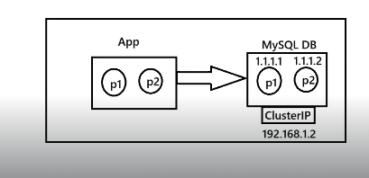

  __NOTE: In real time we will expose the database PODS by using the Cluster-IP service__

  * __K8's ClusterIP service Manifest YML:__

  Create the __java-app-svc.yml__ file and add the below code to create the __ClusterIP service.__

```YAML
---
apiVersion: v1
kind: Service
metadata:
 name: javawebsvc
spec:
 type: ClusterIP
 selector:
  app: javawebapp # POD LABEL
 ports:
  - port: 80
    targetPort: 8080
...
```
  * The Relation between __Service and PODS is label and selector__ . POD will have a label and Service will use that label as a selector to select the PODS that it wants to expose .

  * __Below are the commands to check any Service Information :__

    * __Create the K8's Service.__

      * $ kubectl apply -f java-app-svc.yml

    * __Check the K8's services.__
      
      * $ kubectl get service

    

__NOTE:__ When we use service type as __"ClusterIP"__ , then one static IP will be created to access our PODS __with-in the cluster .__

<mark>
"port" is basically the service port and "targetPort" is the actual port where application is running.

</mark>

## NodePort Service.

* NodePort Service is used to expose PODS outside cluster also.

* When we expose our PODS using NodePort then we can access our PODS using __Worker Node Public IP__ in which our POD is running .

* __We need to enable nodePort number in the security group inbound rules of worker node in which our POD is running.__
  
    * URL to access:  __http://worker-node-public-ip:node-port/app-name/__

* __K8's NodePort Service Manifest YAML.__

Create the __java-app-np-svc.yml__ file and add the below code to create the __NodePort service.__

```yaml
--
apiVersion: v1
kind: Service
metadata:
 name: javawebsvc
spec:
 type: NodePort
 selector:
  app: javawebapp # POD LABEL
 ports:
  - port: 80
    targetPort: 8080
    nodePort: 30070
...
```

__NOTE:___ In the above service manifest file giving nodePort is optional . If we dont give nodePort then k8s will assign random port number .

     * Node Port Range : 30000 - 32767

__NOTE:__ Our application can run in any __Worker Node.__ In that node our application is running inside the __Container__ , __Container running inside the POD__ , __POD is exposed by using Service and using Service we are able to access our application outside the Cluster .__
   
## Combining "POD" & "Service Manifest" in the Single YML File :


* Delete all the resources by executing the below command .

  * __$ kubectl delete all --all__

* K8's POD and Service Manifest YML :

Create the __java-web-app.yml__  file and add the below code to create the __PODS__ and __Service__  Simultaneously

```yaml
---
apiVersion: v1
kind: Pod
metadata:
 name: javawebapppod
 labels:
  app: javawebapp
spec:
 containers:
 - name: javawebappcontainer
   image: ashokit/javawebapp
   ports:
   - containerPort: 8080
---
apiVersion: v1
kind: Service
metadata:
 name: javawebsvc
spec:
 type: NodePort
 selector:
  app: javawebapp
 ports:
  - port: 80
    targetPort: 8080
    nodePort : 30070
...
```
* Create the K8's __POD__ & __Service__ in a single shot .
  
  * __$ kubectl apply -f java-web-app.yml__

  * __$ kubectl get pods__ (To check the PODS)

  * __$ kubectl get service__ (To check the Service)

  * __$ kubectl get pods -o wide__ (To check the POD running on which worker node)

  * __Enable the nodePort 30070 in the inbound rules of the Worker-Node where the POD is running.__

  * __Access the application using below URL :__

     * http://worker-node-public-ip:30070/java-web-app/

  * __Delete all the resources that we have created.__

     * $ kubectl delete all --all

##  Load Balancer Service:

* It is used to expose our PODS outside the cluster 

* When we use Load Balancer service , then one LBR will be created in the AWS Cloud 

* Using Load Balancer DNS URL , we can access our application .

Create the __java-web-app.yml__  file and add the below code to create the __PODS__ and __Service__  Simultaneously

```yaml
---
apiVersion: v1
kind: Pod
metadata:
 name: javawebapppod
 labels:
  app: javawebapp
spec:
 containers:
 - name: javawebappcontainer
   image: ashokit/javawebapp
   ports:
   - containerPort: 8080
---
apiVersion: v1
kind: Service
metadata:
 name: javawebsvc
spec:
 type: LoadBalancer
 selector:
  app: javawebapp
 ports:
  - port: 80
    targetPort: 8080
...
```
* Create the K8's __POD__ & __Service__ in a single shot .

  * __$ kubectl apply -f java-web-app.yml__

  * __$ kubectl get pods (To check the PODS)__

  * __$ kubectl get service (To check the Service)__

  * __App URL :__ lbr-dns-name/java-web-app

__NOTE:__ If we use the __NodePort Service__ , request will always go to first worker node or second worker node but when we expose the PODS by using the __Load Balancer Service__, so the request will be distributed to first worker node PODS and second worker node PODS.


## k8'S Namespaces:

* K8's namespaces are equal to packages in java 

* Namespaces are used to group our K8's resources logically 

  * __frontend-app-pods :__ as one group 
  * __backend-app-pods:__ as one group 
  * __database-pods:__ as one group 

* We can create multiple namespaces in K8's cluster 

   * __ashokit-app-ns , sbi-app-ns , insta-app-ns etc..__

* Namespaces are isolated with each other.

__NOTE:__  When we delete a namespace all the resources which are created under that namespace also gets deleted.

* __Get Namespaces available in k8'S__
  
  * $ kubectl get ns

* We will have below namespaces by default in the K8's cluster.

   * __default__ 
   * __kube-node-lease__
   * __kube-public__ 
   * __kube-system__ 

* When we create any K8's resource without using namespace then K8's will choose default namespace.

* __Get all K8's resources :__

  * $ kubectl get all

* __Get K8's resources of particular namespace.__ 

  * $ kubectl get all -n `<namespace>`

__NOTE:__ It is higly recommended to create our K8's resources using custom namespace 

* __Create the Namespace__

  * $ kubectl create ns `<namespace-name>`

* We can create the K8's namespace using below manifest yml also 

```yaml
---
apiVersion: v1
kind: Namespace
metadata:
 name: ashokit-ns
...		
```

* __Run the below command to create the above namespace .__

  * $ kubectl apply -f `<namespace.yml>`

* __We can delete namespace using below command.__

  * $ kubectl delete ns `<namespace-name>`

* Creating __POD__ and __Service__ using __Custom Namespace.__

Create the __ns-pod-svc.yml__  file and add the below code to create the __PODS__ ,__Service__ & __Namespace__  Simultaneously


```yaml
---
apiVersion: v1
kind: Namespace
metadata: 
 name: ashokit-ns
---
apiVersion: v1
kind: Pod
metadata:
 name: javawebapppod
 namespace: ashokit-ns
 labels:
  app: javawebapp
spec:
 containers:
 - name: javawebappcontainer
   image: ashokit/javawebapp
   ports:
   - containerPort: 8080
---
apiVersion: v1
kind: Service
metadata:
 name: javawebappsvc
 namespace: ashokit-ns
spec:
 type: LoadBalancer
 selector:
  app: javawebapp
 ports:
  - port: 80
    targetPort: 8080
...
```
* Execute the below commands to create __namespace , pods and services:__

  * __$ kubectl apply -f ns-pod-svc.yml__

  * __$ kubectl get ns__

  * __$ kubectl get pods -n ashokit-ns__

  * __$ kubectl get service -n ashokit-ns__

  * __$ kubectl get all -n ashokit-ns__

  * __$ kubectl delete ns ashokit-ns__

## Resources to create PODS in the Cluster :

* As of now we have created PODS manually using POD Manifest YML

* If we delete POD , K8's not recreating POD , hence our application will go down 

* We can delete the POD and get the POD info by using the below commands :
  
   * $ kubectl delete pod `<pod-name>` -n `<namespace>`
   * $ kubectl get pods -n `<namespace>`

__NOTE:__  After deleting the POD , POD is not getting recreated , because we have created the POD manually. Hence we lost the __SELF-HEALING__ Capablity .

__NOTE:__ __We should not create the PODS manually.__

* K8's provides resources to create the PODS.

* It is highly recommended to create the PODS using K8's resources . Below are the K8's resources to create the PODS automatically .

  * __ReplicationController__
  * __ReplicaSet__
  * __Deployment__
  * __StatefulSet__
  * __DaemonSet__

## K8's Resource : ReplicationController 

* ReplicationController (RC) is a K8's resource which is used to create PODS.

* It will make sure always given number of PODS are running for our application .

* RC will take care of the POD life-cycle.

__NOTE:__ When POD is crashed/damaged/deleted then RC will create new POD.

* By using RC , We can scale-up or scale-down our PODS.

__NOTE:__ Node creation will not be taken care by __RC__ , It will be taken care by __EKS.__ 

Create the __java-web-rc.yml__ and add the below code to create the __PODS__ automatically by the __ReplicationController.__

```yaml
---
apiVersion: v1
kind: ReplicationController
metadata:
 name: javawebrc
spec:
 replicas: 2
 selector:
   app: javawebapp
 template:
  metadata:
   name: javawebapppod
   labels:
    app: javawebapp
  spec:
   containers:
   - name: javawebappcontainer
     image: ashokit/javawebapp
     ports:
      - containerPort: 8080
---
apiVersion: v1
kind: Service
metadata:
 name: javawebappsvc
spec:
 type: LoadBalancer
 selector:
  app: javawebapp
 ports:
  - port: 80
    targetPort: 8080
...
```

* __template__ => POD Specification

* Execute the below commands to check the PODS creation by the RC.

  * __$ kubectl delete all --all__
  * __$ kubectl apply -f java-web-rc.yml__
  * __$ kubectl get all__
  * __$ kubectl get rc__
  * __$ kubectl get pods__
  * __$ kubectl get pods -o wide__
  * __$ kubectl delete pod `<pod-name>`__
  * __$ kubectl get pods__

* By the execution of below command , we can scale-up or scale-down the POD count.

  * __$ kubectl scale rc javawebrc --replicas 5__

  * Check the PODS count.

    * __$ kubectl get pods__ 

## K8's Resource : ReplicaSet

* ReplicaSet is replacement for ReplicationController

* ReplicaSet will also manage the POD lifecycle .

* ReplicaSet will also manage the POD count always .

* We can Scale-Up and Scale-Down PODS using ReplicaSet as well 

* The difference between __ReplicationController(RC)__ & __ReplicaSet(RS)__ is __"SELECTOR".__

* __ReplicationController__ supports Equality Based SELECTOR:

```yaml
 selector:
   app: javawebapp
```
* __ReplicaSet__ supports Set Based SELECTOR:

```yaml
 selector:
   matchLabels:
     app: javawebapp
     version:v1
     color:blue
```
Create the __java-web-rs.yml__ and add the below code to create the __PODS__ automatically by the __ReplicaSet.__
```yaml
---
apiVersion: apps/v1
kind: ReplicaSet
metadata:
 name: javawebrs

spec:
 replicas: 2
 selector:
  matchLabels:
   app: javawebapp
 template:
  metadata:
   name: javawebapppod
   labels:
    app: javawebapp
  spec:
   containers:
   - name: javawebappcontainer
     image: ashokit/javawebapp
     ports:
      - containerPort: 8080
---
apiVersion: v1
kind: Service
metadata:
 name: javawebappsvc
spec:
 type: NodePort
 selector:
  app: javawebapp
 ports:
  - port: 80
    targetPort: 8080
    nodePort : 30785
...
```
* Execute the below commands to check the PODS creation by the RS.

  * __$ kubectl delete all --all__
  * __$ kubectl apply -f java-web-rs.yml__
  * __$ kubectl get all__
  * __$ kubectl get rs__
  * __$ kubectl get pods__
  * __$ kubectl get pods -o wide__
  * __$ kubectl delete pod `<pod-name>`__
  * __$ kubectl get pods__
  
* By the execution of below command , we can scale-up or scale-down the POD count.

  * __$ kubectl scale rs javawebrs --replicas 5__

  * Check the PODS count.

    * __$ kubectl get pods__ 

## K8's Resource : Deployment :

* Deployment is one of the K8's Resource/Component

* Deployment is the most recommended approach to deploy our applications in the K8's Cluster.

* Using Deployment , We can scale-up or scale-down the PODS.

* Deployment supports Rolling updates & Rollbacks.

* We can deploy the latest code with zero down time .

* __DEPLOYMENT STRATEGIES :__

   * __ReCreate :__ It will delete all the existing PODS and it will create new PODS (app downtime will be there)

   * __Rolling Update:__ It will delete the PODS and create the POD one by one .

   * __Canary :__ When the new code is deployed, few requests will be diverted to the new code.

* Create the __java-deployment.yml__ and add the below code to create the __PODS__ automatically by the __Deployment.__

```yaml
---
apiVersion: apps/v1
kind: Deployment
metadata:
 name: javawebappdeployment
spec:
 replicas: 2
 strategy: 
  type: RollingUpdate
 selector:
  matchLabels:
   app: javawebapp
 template:
  metadata:
   name: javawebapppod
   labels:
    app: javawebapp
  spec:
   containers:
   - name: javawebappcontainer
     image: ashokit/javawebapp
     ports:
     - containerPort: 8080
---
apiVersion: v1
kind: Service
metadata:
 name: javawebappsvc
spec:
 type: NodePort
 selector:
  app: javawebapp
 ports:
  - port: 80
    targetPort: 8080
    nodePort : 30785
...
```
* Execute the below commands to check the PODS creation by the Deployment 

  * __$ kubectl delete all --all__
  * __$ kubectl apply -f java-deployment.yml__
  * __$ kubectl get all__
  * __$ kubectl get deployment__
  * __$ kubectl get pods__
  * __$ kubectl get svc__
  * __$ kubectl get pods -o wide__
  * __$ kubectl delete pod `<pod-name>`__
  * __$ kubectl get pods__
  * __$ kubectl scale deployment javawebappdeployment --replicas 3__

## Blue-Green Deployment :

* It is the most famous application relese model 

* It reduces risk and minimimizes the downtime of the application .

* It will maintain two environments named as __"BLUE"__ and __"GREEN"__ environments .

* __"OLD"__ version is called as __Blue environment__

* __"LATEST"__ version is called as __Green environment.__

* Existing application will run in __"BLUE PODS"__ and live service will expose __BLUE PODS__ for end users access .

* Latest application will run in __"GREEN PODS"__ . Once __GREEN PODS__ functionality tested then we will divert traffic from __BLUE PODS__ to __GREEN PODS__ by changing live service __POD Selector.__

   * 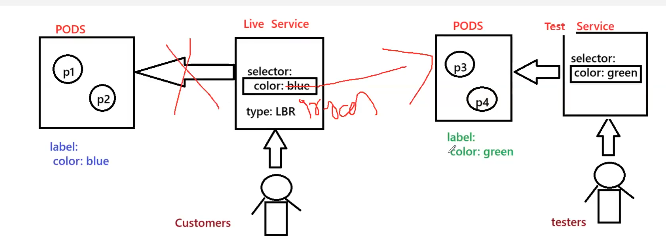

* __We will create the below 4 Manifest YML files to perform the deployment using Blue-Green Deployment model:__

   * __blue-pods-deployment.yml__
   * __live-service.yml__
   * __green-pods-deployment.yml__
   * __pre-prod-service.yml__

* __Below are the steps to deploy the application in the K8's Cluster using Blue-Green Deployment model.__

  * __Step 1:__ Clone the below Git Repository :
     
     * https://github.com/ashokitschool/kubernetes_manifest_yml_files.git

  * __Step 2:__ Create __BLUE__ Deployment __PODS__ 

  * __Step 3:__ Create __Live Service__  to expose __BLUE PODS (VERSION: V1 )__

    * __Live Service URL :__ http://node-ip:30785/java-web-app/

  * __Step 4: Modify the code in GIT Repo + Build Project + Build Docker Image + Push Docker Image to Docker Hub__ 

  * __Step 5:__ Create __GREEN__ Deployment __PODS__

  * __Step 6:__ Create __Pre-Prod Service__ to expose the __GREEN PODS (VERSION: V2)__

     * __Pre-Prod Service URL :__ http://node-ip:31785/java-web-app/

## Config Map & Secrets :

* Every application will have several environments for testing purpose .
  
  * __DEV ENVIRONMENT :__ Developer's  will do the testing in this environment 
  * __SIT ENVIRONMENT :__ Testing team will test the functionality here (System Integration Testing)
  * __UAT ENVIRONMENT :__ Client Side Testing(User Acceptance Testing)
  * __PILOT ENVIRONMENT :__ Pre-Prod Testing

  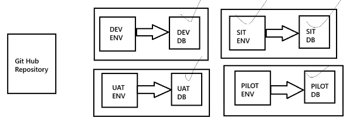
* Once testing completed in all the above environments , then only application will be deployed in the __PROD__ environment .

* For every environment , application properties will be different.

  * __Database Properties__
  * __Kafka Properties__
  * __SMTP Properties__ 
  * __Redis Properties__

__NOTE :__ We should not hard-code these properties in our application .

* Using __ConfigMap & Secret__ , we can pass environment specific properties for our application dynamically .

* __ConfigMap & Secret__ concepts are used to avoid hard coded properties in our application 

*  __Config Map & Secret__ allows us to de-couple application properties from Docker images so that our application can be deployed into any environment without making any changes for our Docker image.

* __ConfigMap & Secret__ will represent data in key-value format.

* __ConfigMap__ is used to store non-confidential data & __Secret__ is used to store confidential data like passwords , pin , security codes etc .

__NOTE:__  __ConfigMap & Secrets will make docker images as portable.__

* 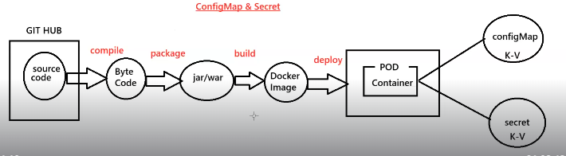


* __Application Properties (Hard Coded values) [NOT RECOMMENDED]__

```yaml
spring:
  datasource:
    driver-class-name: com.mysql.cj.jdbc.Driver
    url: jdbc:mysql://mysqldb:3306/sbms
    username: root
    password: root
  jpa:
    hibernate:
      ddl-auto: update
    show-sql: true
```


 * __Application Properties (with Env Variables) [RECOMMENDED]__

```yaml
spring:
  datasource:
    driver-class-name: ${DB_DRIVER:com.mysql.cj.jdbc.Driver}
    url: ${DB_URL:jdbc:mysql://mysqldb:3306/sbms}
    username: ${DB_USERNAME:root}
    password: ${DB_PASSWORD:root}
  jpa:
    hibernate:
      ddl-auto: update
    show-sql: true
```

* __ConfigMap Manifest YML File:__

```yaml
---
apiVersion: v1
kind: ConfigMap
metadata:
  name: ashokit-config-map
  labels:
   storage: ashokit-db-config-map
data:
  DB_DRIVER: com.mysql.cj.jdbc.Driver
  DB_URL: jdbc:mysql://mysqldb:3306/sbms
  DB_USERNAME: root
...
```

* __Secret Manifest YML File:__

  __NOTE :__  URL To encode : https://www.base64encode.org/
```yaml
---
apiVersion: v1
kind: Secret
metadata:
  name: ashokit-secret
  labels:
   storage: ashokit-db-secret
data:
  DB_PASSWORD: cm9vdA==
type: Opaque  
...
```
* __Reading Data from ConfigMap :__

```yaml
- name: DB_DRIVER
  valueFrom:
   configMapKeyRef:
    name: ashokit-config-map
    key: DB_DRIVER
```

* __Reading Data From Secret:__

```yaml
- name: DB_PASSWORD
  valueFrom:
   secretKeyRef:
     name: ashokit-secret
     key: DB_PASSWORD
```

## Spring-Boot + MySQL -  K8's Deployment:

__Github Repo for Manifest YML Files:__ https://github.com/ashokitschool/kubernetes_manifest_yml_files.git

__Github Repo for SpringBoot + MySQL:__ https://github.com/ashokitschool/spring-boot-mysql/tree/main

__Below are the steps to deploy the application in the K8's Cluster.__

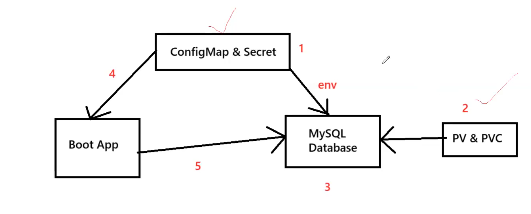


* Create ConfigMap:
  
  * __$ kubectl apply -f weshopify-db-configmap.yml__
  * __$ kubectl get cm__

* Create Secret :

   * __$ kubectl apply -f weshopify-db-secret.yml__
   * __$ kubectl get secret__

* Create PV :

   * __$ kubectl apply -f weshopify-db-pv.yml__
   * __$ kubectl get pv__

* Create PVC :

   * __$ kubectl apply -f weshopify-db-pvc.yml__
   * __$ kubectl get pvc__

* Create Database Deployment.

  * __$ kubectl apply -f weshopify-db-deployment.yml__
  * __$ kubectl get pods__
  * __$ kubectl get svc__

   __NOTE:__ We can check mysql db is running in the POD or not via below commands .

    * __$ kubectl exec -it `<db-pod-name>` /bin/bash__
    * __mysql -u root -proot__
    * __show databases;__

  __NOTE:__ Execute the __exit__ command to come out from the database and again execute the __exit__ command to comeout from the database POD.

* Create Application Deployment.

     * __$ kubectl apply -f weshopify-app-deployment.yml__
     * __$ kubectl get pods__
     * __$ kubectl get all__

  


* __NOTE:__ Check app pod running in which worker node then enable node-port number in security group in-bound rules and access the application. 

<mark>
Database POD is exposed as a service , With that service name Application POD can access the database . In the Docker , network is used to communicate from one container to another container . Here both containers are running in the PODS and both PODS are running in the same cluster , so directly by using the service name it can access .
 
</mark>

## Logs-Monitoring :

* In realtime our application will run in multiple __PODS.__

* When some problem occured in application execution then we have to check the logs of the application.

* To check the logs , we will use the below command in K8's.

  * __$ kubectl logs `<pod-name>`__

__NOTE :__ If we have 1 or 2 PODS then easily we can check logs , What if we have 100 PODS. checking 100 PODS logs to identify the issue is very difficult .

* To overcome this problem , __We will setup Log-Aggregation in the K8's Cluster using EFK Stack.__

## What is EFK Stack ?

* It is a collection of three open source products : __Elasticsearch, Fluentd and Kibana.__

* __EFK Stack__ provides __centralized logging__ in order to identify problems with servers or applications .

* It allows you to search the logs in a single place .

* 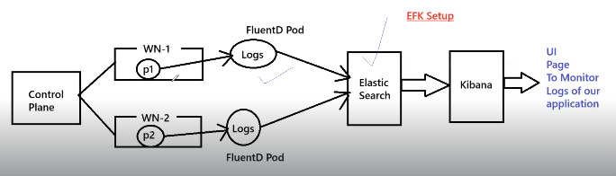
  
  * 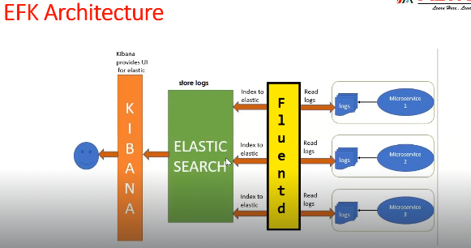

    * 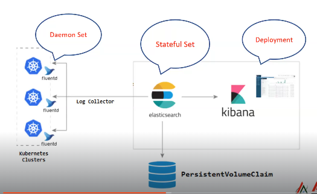

* __StatefulSet :__ It is used to create __PODS__ with Stateful Behaviour. 
* __DaemonSet :__ It is used to create the __POD__ in each Worker Node. 

  * __Kibana__ will be executed as a __Deployment.__
  * __Elastic-Search__ will be executed as a __StatefulSet.__
  * __FluentD__ will be excuted as a __DaemonSet.__ 
  
* <mark>
   For all the Team members , Production Env. Cluster access won't be available , but Non-Prod Env. Cluster access will be available.
  </mark>
* __Below are the steps to setup the EFK Stack in the K8's Cluster :__

  * Deploy one application using Deployment Manifest.

     * Application Docker Image : ashokit/sb-logger-app

  * Expose application using K8's Service (LBR).

  * Deploy __ElasticSearch PODS__ using __StatefulSet.__

  * Deploy __FluentD PODS__ using DaemonSet.

  * Deploy __Kibana__ and expose as __LBR Service.__ 

  * Access __Kibana dashboard__ and setup index pattern to get logs. 

  * Access __application logs in kibana dashboard.__ 
