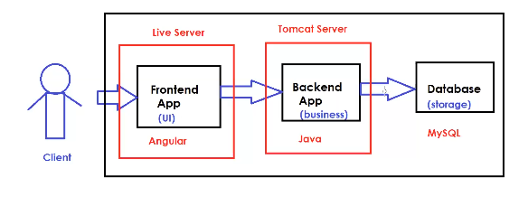
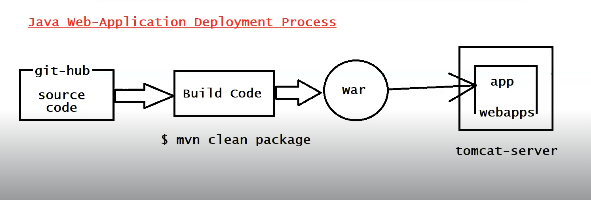
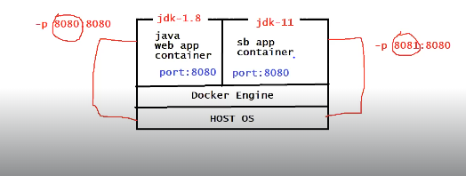
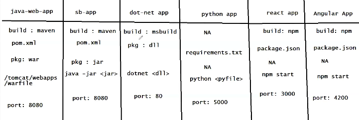
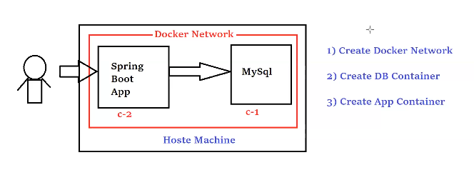
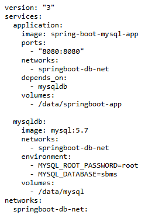
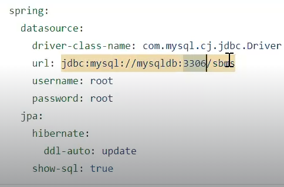

## Software Application Tech-Stack :

* __Frontend__ -> It Contains User Interface (Presentation Logic)

* __Backend__ -> It contains Business Logic 

* __Database__ -> It is used to store the data.

    * __Frontend Technologies__  -> Angular /React/ Vue JS 

    * __Backend Technologies__    -> Jav / .Net/Python/Node JS /PHP

    * __Database Technologies__  -> Oracle /MySQL/SQLServer/Postgres/ Mongo DB 

    

## Ashok-IT Insta App Tech Stack :

  * __Frontend__ : Angular V13
  * __Backend__ : Java 11V
  * __Web Server__ : Tomcat 9.5V
  * __Database__ : MySQL 8.5V

## Environment setup to run Ashok IT - Insta Application :

 * Take One Computer.
 * Install Angular V13 software 
 * Install Live Server 
 * Install Java 11V software 
 * Install Tomcat 9.0V software 
 * Install MySQL 8.5V Database 

## Application Environments :

In real time we use several environments to test our application .

   * __DEV Env__ : It is used by developers for Code Integration Testing.
   * __SIT/QA Env__ : It is used by software testing team for System Integration Testing.
   * __UAT Env__ : It is used by Client for User Acceptance Testing.
   * __Pre-PROD__ : It is used for final testing before production .
   * __PROD Env__ : It is for live execution (End Users can access our application here)
   
   * 

* As a devops engineer we are responsible to setup infrastructure to run our application.

* We need to install all required softwares (dependencies) to run our application

  * __NOTE__ : We need to setup dependencies in all environments to run our application.

  * __NOTE__ : There is a chance of doing mistakes in dependencies installation process (version compatability issues can occur)

* To overcome the above problems , we use the __Containerization (Docker)__

## What is Docker ???

  * Docker is used for __Containerization.__

  * Containerization means package our  __"Code + Dependencies"__ for easy deployment/Execution .

  * Using Docker we can run our application code in any machine/environment without bothering about softwares installation because docker will take care of the dependencies installation .

    * __Docker Architecture :__

        * __Dockerfile__ : It contains set of instructions to download dependencies and build docker Iimage

        * __Docker Image__ : It is a package which contains code + required dependencies .

        * __Docker Registry__ : It is a place where we can store the Docker Images .

        * __Docker Container__ : When we run docker image , it will run our application inside container .
        
        

## Install Docker in Linux VM :

* Login into the AWS Cloud Account .

* Create Linux Virtual Machine (Amazon Linux)

* Connect with Linux VM using Mobaxterm/Putty.

* Install Docker Software by executing the below commands.

  * __$ sudo yum update -y__

  * __$ sudo yum install docker -y__

  * __$ sudo service docker start__

* Add ec2-user to a docker group.

  * __$sudo usermod -aG docker ec2-user__

* Restart the Session and Connect again .

  * __exit__  (Press 'R' to restart the session in Mobaxterm)

* Verify Docker Installation :

  * __docker -v__

## Docker Commands :

 * To display docker images in our system :

   * __$ docker images__

* To display running docker containers in our machine .

   * __$ docker ps__

* To display stopped and running containers.

   * __$ docker ps -a__

* To download the docker image 

   * __$ docker pull `<imagename>`__

* Run docker image to create docker container.

   * __$ docker run `<imagename>`__

* Run the docker container in the detached mode :

   * __$ docker run -d `<imagename>`__

   __NOTE:__ Detached mode will help us to run the other commands in the same tab .

* Display docker container logs :

  * __$ docker logs  `<conatiner-id>`__

* Stop  Running docker container :

  * __$ docker stop `<container-id>`__

* Start docker container which is stopped :

  * __$ docker start `<container-id>`__

* Delete the docker container which is in stopped state.

   * __$ docker rm `<container-id>`__

* Delete the running docker container .

   * __$ docker rm -f `<container-id>`__ 

* Delete the docker image.

   * __$ docker rmi -f `<image-name/image-id>`__ 

* Delete all stopped containers + Unused docker images.

    * __$ docker system prune -a__

## Running the docker container with the port mapping :

__Docker Image Name :__ ashokit/spring-boot-rest-api (Downloaded from Docker-Hub)

* __$ docker pull ashokit/spring-boot-rest-api__

* __$ docker run -p 8000:8080 -d ashokit/spring-boot-rest-api__ (-p : port mapping , -d :detached mode)

__NOTE:__ In the above command we are mapping __host port to container port__ to access application outside of the container . __[Container is the different Linux Machine]__

 * 

__NOTE__ : After running application with the above command __we need to enable the host port in the security group Inbound rules.__

   * __URL :__ 13.201.131.99:__8000__/welcome/sunny

## What is Docker file ??

* It contains set of instructions to build the docker image .

* To write the docker file , we will use the below commands :

   * __FROM__
   * __MAINTAINER__
   * __RUN__
   * __CMD__
   * __COPY__
   * __ADD__
   * __WORKDIR__
   * __EXPOSE__
   * __ENTRYPOINT__
   * __USER__

* __FROM Command :__

  * It is used to specify the base image to create our own docker image.

     * __FROM__ openjdk:17
     * __FROM__ python:3.3
     * __FROM__ node:19.5
     * __FROM__ mysql:8.5
     * __FROM__ tomcat:9.0

* __MAINTAINER Command:__

   * It is used to specify the author of the docker file.

      * __MAINTAINER__ Ashok<ashok.b@oracle.com>
    
* __RUN Command:__

   * It is used to specify the instructions to execute when docker image is creating.

     * __RUN__ 'git clone <url>'
     * __RUN__ 'mvn clean package'

     __NOTE :__  We can write multiple RUN instructions in single docker file and all those instructions will be processed in the order. 

* __CMD Command:__

  * It is used to specify the instructions to execute when docker container is getting created.

  * Execute __JAR file__ or move __WAR file__ to the Tomcat . 

     * __CMD__ 'java -jar app.jar'

    __NOTE__ : If we write multiple CMD instructions , Docker will execute only last CMD instruction .

* __COPY Command:__

  * It is used to copy the files from the host machine to container machine .
    
    * __COPY__ target/java-app.jar /usr/app
    * __COPY__ target/webapp.war  /usr/app/tomcat/webapps
    * __COPY__ python-app.py /usr/app

* __ADD Command :__

  * It is also used to copy the files from host mahine to container machine.

    * __ADD__ target/java-app.jar /usr/app
    * __ADD__ target/webapp.war  /usr/app/tomcat/webapps
    * __ADD__ python-app.py /usr/app

    __NOTE:__  __ADD__  command supports HTTP URL for Source Files.
     
        * ADD <URL> /usr/app

* __WORKDIR Command :__

   * It is used to specify working directory location to process further docker file instructions.

      * __WORKDIR__ /usr/app

* __EXPOSE Command :__

   * It is used to specify on which port number our container will run.

      * __EXPOSE__ 8080

      __NOTE:__ By using __EXPOSE__ keyword we can't modify the Container/Application Port. It is just used for Readability.

* __ENTRYPOINT__ Command:

    * It is used to run our application code in the docker container, when the docker container is getting created. 

      * __ENTRYPOINT__["java", "-jar", "app.jar"]
      * __ENTRYPOINT__["python", "app.py"]

*  __USER__ Command :

    * It is used to specify the USER account to execute dockerfile instructions .

       * __USER__ root
       * __USER__ ec2-user
       * __USER__ sunny 

* __ARG__ Command :

    * It is used to pass dynamic values 

       * __ARG__ branch-name 
       * __RUN__ sh 'git clone -b $branch-name `<repo-url>`

## __Sample Docker File:__

  * __$ vi Dockerfile__ 

  * __Keep below contents in the docker file .__

       * FROM ubuntu
       * MAINTAINER Ashok <ashok.b@oracle.com>
       * RUN echo 'hello from run instruction-1'
       * RUN echo 'hello from run instruction-2'
       * CMD echo 'hi from cmd-1'
       * CMD echo 'hi from cmd-2'

  * __Build docker image using the above docker file .__

       * $ docker build -t myimage . [It will search the Dockerfile in the current working directory.]

  * __Run docker image to create docker container.__

       * $ docker run myimage

  * __Q. Can we change the docker file name ?__
  
   * __A.__ The default name for docker file is "Dockerfile" (No Extension) , but we can  change docker file name by passing that file-name in build command like below :

      * __$ docker build -t `` -f `<file-name>`__

## How to push docker images in the docker-hub account?

* __Login into the docker-hub account.__ 

  * $ docker login

* __Tag the docker image.__

   * $ docker tag `<image-name>` `<tag-name>`

      * $ docker tag backend kakraniaws/backend

* __Push the docker image to the docker hub.__

    * docker push `<tag-name>`

## How to dockerize Java Web Application ??

* Project source code will be available in the Git Repo.

* We need to clone git repo into our machine & We need to build that code 

* To build the java projects , we will use maven as a build Tool .

* To build java project using Maven we will execute maven goals like below :

   * __$ mvn clean package__

* Java web-app will be packaged as a WAR (Web-Archieve) file 

   * __NOTE:__ WAR file will be created in project target directory .

* To run WAR file , We need to keep WAR file in tomcat server webapps folder __(DEPLOYMENT)__.

  

* __Step 1: Install the git software__

    * $ sudo yum install git

* __Step 2: Clone the Git Repo.__

   * $ git clone https://github.com/ashokitschool/maven-web-app.git

* __Step 3: Go Inside the Project Directory__ 

    * $ cd maven-web-app

* __Step 4 : Install Maven Software__

   * $ sudo yum install maven 

* __Step 5 : Build project using maven goals__

   * $ mvn clean package 

* __Step 6 :  Create Dockerfile.__

    * $ vi Dockerfile (It's already there in the cloned project , but we an create as well)

      * FROM tomcat:latest
      * MAINTAINER Ashok <ashok@oracle.com>
      * EXPOSE 8080
      * COPY target/maven-web-app.war /usr/local/tomcat/webapps/maven-web-app.war

* __Step 7: Build the docker image__

  * $ docker build -t maven-web-app .

* __Step 8 : Check the docker image created or not__

   * $ docker images 

* __Step 9 : Run the docker image__

  * $ docker run -p __8000:8080__ -d maven-web-app

* __Step 10 : Check Docker container and its logs.__

   * docker ps
   * docker logs `<container-id>`

* __Step 11: Enable 8000 port in EC2 VM security group inbound rules & access the application in web browser.__

   * http :public-ip :8000/maven-web-app

## How to dockerize Spring-Boot Application ?

* Spring-Boot is a java based framework 

* Using Spring-Boot we can develop java applications easily 

* Spring-Boot applications will be packaged as a JAR file for Execution/Deployment

* To run Spring-Boot applications , we need to run the JAR file like below :

   * __$ java -jar `<jar-file-name>`__

  __NOTE:__ To run JAR file , we need JAVA software.

    * 

*   __Step 1: Clone the git repo.__

    * $ git clone https://github.com/ashokitschool/spring-boot-docker-app.git

* __Step 2 : Go inside the project Directory.__

   * $ cd spring-boot-docker-app

* __Step 3:  Build project using maven goals.__

   * $ mvn clean package

* __Step 4: Create Dockerfile.__

   *  $ vi Dockerfile (It's already there in the cloned project , but we an create as well)

      * FROM openjdk:11
      * MAINTAINER "Ashok Bollepalli <797979>"
      * COPY target/spring-boot-docker-app.jar  /usr/app/
      * WORKDIR /usr/app/
      * EXPOSE 8080
      * ENTRYPOINT ["java", "-jar", "spring-boot-docker-app.jar"]

* __Step 5: Build the docker image.__

    * $ docker build -t sb-app .

* __Step 6 :Check the docker image created or not.__

   * $ docker images

* __Step 7 : Run the docker image__

   * $ docker run -p 8000:8080 -d sb-app

* __Step 8 : Check Docker container and its logs.__

   * docker ps
   * docker logs `<container-id>`

* __Step 11: Enable 8000 port in EC2 VM security group inbound rules & access the application in web browser.__

   * http :public-ip :8000/

## Can we get into the docker Container Machine ??

Yes , It is possible to get into the Docker Container Machine by using the below commands .

 * __Display running docker containers info:__

   * $ docker ps

 * __Get into container using container id:__

   * $ docker exec -it `<container-id>` /bin/bash

 * __Check the files in PWD (Present Working Directory)__
 
    * ls -l 

 * __Come out from the Container VM to Host VM.__ 

   * $ exit

## Difference between RUN vs CMD vs ENTRYPOINT in Dockerfile ??

__RUN :__ To execute the instructions while the Docker Image is getting created .

__CMD :__ To execute the instructions when the Docker Container is getting created .

__ENTRYPOINT :__ To execute the instructions when the Docker Container is getting created.

__NOTE:__ __CMD instructions__ , we can override while running docker image where as __ENTRYPOINT instructions__ we cannot override . If you want to execute some commands for sure at the time of docker container creation , we should use __ENTRYPOINT__ Command.

## Can we run two containers on the same Host Machine ?

Yes it's possible to run multiple containers on the same host machine , because containers will be a separate virtual Linux machine and our applications will be running in the separate virtual machines at the time when we will run our docker image .

  * 

## How to dockerize Python-Flask Application ?

*   __Step 1: Clone the git repo.__

    * $ git clone https://github.com/ashokitschool/python-flask-docker-app.git
    

* __Step 2 : Go inside the project Directory.__

   * $ cd python-flask-docker-app

* __Step 3: Create Dockerfile.__

   *  $ vi Dockerfile (It's already there in the cloned project , but we an create as well)

      * FROM python:3.6
      * MAINTAINER Ashok Bollepalli "ashokitschool@gmail.com"
      * COPY . /app
      * WORKDIR /app
      * EXPOSE 5000
      * RUN pip install -r requirements.txt
      * ENTRYPOINT ["python", "app.py"]

* __Step 4: Build the docker image.__

    * $ docker build -t python-app .

* __Step 5 :Check the docker image created or not.__

   * $ docker images

* __Step 6 : Run the docker image__

   * $ docker run -p 8000:5000 -d python-app

* __Step 7 : Check Docker container and its logs.__

   * docker ps
   * docker logs `<container-id>`

* __Step 8: Enable 8000 port in EC2 VM security group inbound rules & access the application in web browser.__

   * http :public-ip :8000/ 

## How to dockerize the React application ??

*   __Step 1: Clone the git repo.__

    * $ git clone https://github.com/ashokitschool/python-flask-docker-app.git
    

* __Step 2 : Go inside the project Directory.__

   * $ cd python-flask-docker-app

* __Step 3: Create Dockerfile.__

   *  $ vi Dockerfile (It's already there in the cloned project , but we an create as well)

      * FROM python:3.6
      * MAINTAINER Ashok Bollepalli "ashokitschool@gmail.com"
      * COPY . /app
      * WORKDIR /app
      * EXPOSE 5000
      * RUN pip install -r requirements.txt
      * ENTRYPOINT ["python", "app.py"]

* __Step 4: Build the docker image.__

    * $ docker build -t python-app .

* __Step 5 :Check the docker image created or not.__

   * $ docker images

* __Step 6 : Run the docker image__

   * $ docker run -p 8000:5000 -d python-app

* __Step 7 : Check Docker container and its logs.__

   * docker ps
   * docker logs `<container-id>`

* __Step 8: Enable 8000 port in EC2 VM security group inbound rules & access the application in web browser.__

   * http :public-ip :8000/ 

## How to dockerize the React/Angular application ??

* __Step 1: Clone the git Repo.__

   * $ git clone https://github.com/ashokitschool/ReactJS_Docker_App.git

* Execute the below Dockerfile for the React application and do the same steps that we did earlier .

  * FROM node:latest
  * WORKDIR /app
  * COPY package*.json ./
  * RUN npm install 
  * COPY . .
  * EXPOSE 3000
  * ENTRYPOINT ["npm", "start"]

   

__NOTE:__  When the host machine is our Windows Machine , then we dont use the public IP , We use __localhost.__

## Docker Network 

*  Network is all about Communication .

* Docker network is used to provide isolated network for containers

* If we run 2 containers under same network then one container can communicate with another container.

* By default we have 5 networks in Docker.

   * bridge
   * host
   * none
   * Overlay
   * MacvLan

* __Bridge Network:__ Bridge Network is used to run standalone containers. It will assign one IP for container. It is the default network for docker container.

* __Host Network:__ Host Network is also used to run standalone containers. This will not assign any ip for our container.

* __None Network:__ None means no network will be available.

* __Overlay Network:__  Overlay network is used for Orchestration purpose (Docker Swarm)	

* __MacvLan Network:__ Macvlan network will assign physical Ip for our container.	

* __Display docker networks :__
  
   * $ docker network ls

* __Create docker network:__

   * $ docker network create ashokit-nw

* __Inspect docker network__
   
   * $ docker network inspect ashokit-nw

   __NOTE:__ We can inspect the docker images and docker container as well .

       * $ docker inspect `<image-name>`
       * $ docker inspect `<container-id>`

* __Create docker container with custom network:__

   * $ docker run -d -p 8080:8080 __--network ashokit-nw__ sb-app-image

* __Delete docker network:__

   * $ docker network rm ashokit-nw

##  Docker Compose 

* Docker Compose is used to manage multi-container based applications.

* Nowadays projects are developing by using Micro-Services Architecture .

* In Micro-Services Architecture , multiple backend API's will be available .

   * FLIGHTS-API
   * TRAIN-API
   * CABS-API
   * TRAINS-API

* To run our application , __We need to create separate containers for every API .__

__NOTE:__ Managing (Create/Stop/Start) all these containers manually is very difficult. To overcome this we use __"Docker Compose"__

__NOTE:__ With a single command , we can __"create/stop/start"__ multiple containers using Docker Compose . 

* We will use __"docker-compose.yml"__ to provide containers information to docker compose tool.

* __Docker Compose YML file should contain all the information related to Containers and Containers dependencies.__

* __Docker Compose Setup:__

   * __Install Docker Compose :__

      *  ` $ sudo curl -L "https://github.com/docker/compose/releases/download/1.24.0/docker-compose-$(uname -s)-$(uname -m)" -o /usr/local/bin/docker-compose`

   * __Give Permission.__

      * $ sudo chmod +x /usr/local/bin/docker-compose

   * __Check docker compose is installed or not.__

      * $ docker-compose --version

## Spring Boot with MySQL DB using Docker-Compose:

* 

* __"docker-compose.yml file"__ for the sprigboot application:

  * 

  * 

* __Application-Execution process which contains both Dockerfile & docker-compose.yml file :__

  * __Step 1: Clone the git repo .__

     * $ git clone https://github.com/ashokitschool/spring-boot-mysql-docker-compose.git

  * __Go inside the project directory .__

    * $ cd spring-boot-mysql-docker-compose

  * __Build project using Maven :__

    * $ mvn clean package

  * __Build the docker-image:__

    * $ docker build -t spring-boot-mysql-app .

  * __Check docker images .__

    * $ docker images

  * __Create docker containers using docker-compose.__

    * $ docker-compose up -d

  * __Check docker containers are running or not .__

    * $ docker-compose ps

  * __Stop running docker containers:__

    * $ docker-compose stop

  * __Start stopped docker containers:__

    * $ docker-compose start

  * __Delete docker containers using docker-compose__
   
     * $ docker-compose down

__NOTE:__  Enable 8080 port in EC2 VM security group inbound rules & access the application in web browser.

  * http :public-ip :8080/

__NOTE:__  We have to run the docker-compose commands where the __docker-compose.yml__ file is present .

__NOTE:__ With the single command __docker-compose up -d__ , first the network would be created and then the DB container would be created  after that the application container would be created, similary with the single command __docker-compose down__ (Network and Containers would be deleted) 

__NOTE :__ Port Mapping of the database container is not required , because database we don't access outside , database is only for application access purpose .

* __How we can check that the data has been stored in the database using Spring-Boot application?__

   * Run the below docker-compose command to see the containers available (Application Container + Database Container)

      * __$ docker-compose ps__ 

   * Switch to Database Container machine by the below command :

      * __$ docker exec -it spring-boot-mysql-docker-compose_mysqldb_1 /bin/bash__

   * Enter the credentials to login into the database software which is present on the Database Container machine .

      * __mysql -u root -proot__

   __NOTE:__ Now you have entered into the database machine , you can see the records getting inserted or not .

   * execute the __exit__ command to come out from the database and again execute the __exit__ command to come out from the database container to the host machine .  

* __Shell-Script to dockerize the Spring-Boot application which will connect with the mysql database:__ 

     * __Create the shell-Script file.__

        * $ vi deployment.sh

     * __Add the below content into the deployment.sh file .__

       * git clone https://github.com/ashokitschool/spring-boot-mysql-docker-compose.git
       * cd spring-boot-mysql-docker-compose
       * mvn clean package
       * docker build -t spring-boot-mysql-app .
       * docker-compose up -d

   * __Execute the shell script file to dockerize our application .__

     * $ sh deployment.sh

## Stateful vs Stateless Containers :

* __Stateless Container:__ Data will be deleted , after the container got deleted.

* __Stateful Container :__ Data will be maintained permanently 

  __NOTE:__ Docker containers are stateless by default.

  __NOTE:__ In spring-boot-mysql application, We are using mysqldb as docker container to store application data. When we re-create containers db also got recreated hence we lost data (this is not accepted in realtime).

  * To maintain data permanently, __we need to make docker container as stateful.__

  * To make container as stateful, we need to use __Docker Volumes__ concept.

## Docker Volumes :

 * Volumes are used to persist data which is generated by docker container.

  * Volumes are used to avoid data loss

  * Using volumes we can make container as statefull

 * We have 3 types of volumes in docker:
 
    * Anonymous volume (no name)
	 * Named Volume
	 * Bind mounts

* __Display Docker Volumes__
  * $ docker volume ls
  
* __Docker Volume Create__
   *  $ docker volume create `<vol-name>`

* __Inspect Docker Volume__
  * $ docker volume inspect <vol-name>

* __Remove Docker Volume__
   * $ docker volume rm <vol-name>

* __Remove all docker volumes__
   * $ docker system prune --volumes

* __Making the Docker Container stateful using Bind Mount:__

   * Create a directory on the host machine .

      * $ mkdir app

      * Map __'app'__ directory to container in docker-compose.yml file like below :

        
        * 

## Docker-Swarm (Outdated in the market):

  * It is a container orchestration platform .

  * Docker Swarm is used to setup docker cluster __[Cluster = Group of Servers/Machines]__

  * We will setup Master and Worker nodes using Docker Swarm Cluster .

  * Master Node will schedule the tasks (Containers) and manage the worker nodes and node failures .

  * Worker Nodes will perform the action (Containers will run here) , based on master-node instructions 

  * Docker Swarm is embedded in the Docker Engine (No need to install Docker Swarm Separately)

  * __Docker Swarm Cluster Setup :__

    * __Create 3 EC2 instances (ubuntu) & install docker in all 3 instances using below 2 commands;__

      * $ curl -fsSL https://get.docker.com -o get-docker.sh
      * $ sudo sh get-docker.sh

    __NOTE :__ Enable 2377 port in security group for Swarm Cluster Communications.

    * __Connect to Master Machine and execute below command:__

      * Initialize docker swarm cluster

         * $ sudo docker swarm init --advertise-addr `<private-ip-of-master-node>`
         * EX : $ sudo docker swarm init --advertise-addr __172.31.41.217__

      * Get Join Token from master (This token is used by worker's to join with master)

         * $ sudo docker swarm join-token worker

      __NOTE:__  Copy the token and execute in all worker nodes with sudo permission
      
         * EX: sudo docker swarm join --token SWMTKN-1-4pkn4fiwm09haue0v633s6snitq693p1h7d1774c8y0hfl9yz9-8l7vptikm0x29shtkhn0ki8wz 172.31.37.100:2377
         
      __NOTE:__ In Docker swarm we need to deploy our application as a service.

* __Docker-Swarm Service :__

  * Service is collection of one or more containers of same image.

     * $ sudo docker service create --name `<serviceName>` -p `<hostPort>:<containerPort>` `<imageName>`
     * EX: $ sudo docker service create --name java-web-app -p 8080:8080 ashokit/javawebapp

     __NOTE :__ By Default , only one replica will be created and we can access our application using the below URL pattern :

       *   	URL : http://master-node-public-ip:8080/java-web-app/ __(Incoming requests will be handled by master node only)__

   * __Check the services created:__
     * $ sudo docker service ls 

   * __We can scale docker service.__
     *  $ docker service scale `<serviceName>=<no.of.replicas>`

  * __Inspect docker service:__
    * $ sudo docker service inspect --pretty `<service-name>`

  * __See service details:__
    * $ sudo docker service ps `<service-name>`

  * __Remove one node from swarm cluster:__
    * $ sudo docker swarm leave

  * __Remove docker service:__ 
    * $ sudo docker service rm `<service-name>`

* __NOTE :__ The main disadvantage of using the Docker-Swarm is that we cannot scale up or scale down the containers , but this is possible via different Orchestration tools like __K8's & Open-Shift__

* __NOTE :__ In real time ,for every environment (one cluster will be available)

